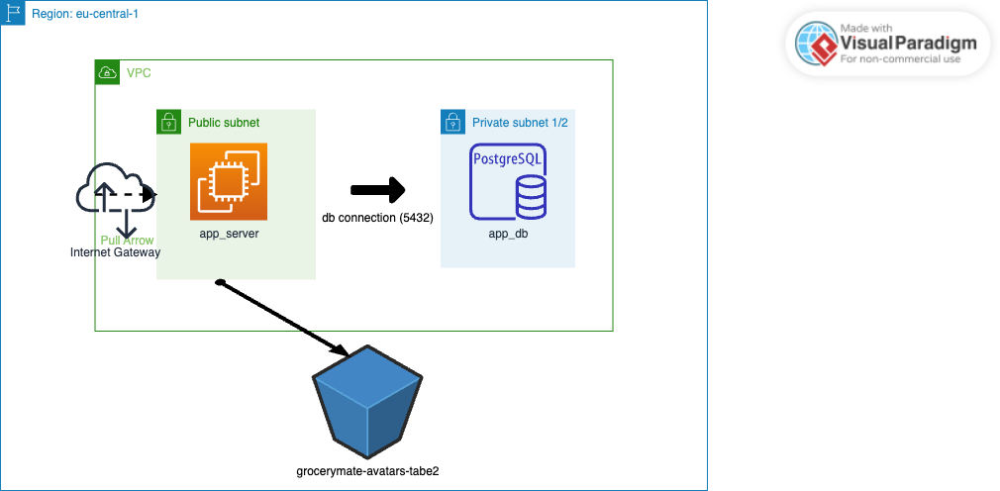

# AWS GroceryMate Project

## Project Overview

AWS GroceryMate is a cloud-based application deployed on AWS. It includes:

- EC2 instance for the application server

- PostgreSQL RDS for the database

- S3 bucket for storing avatars

- Secure network setup (VPC, subnets, security groups, internet gateway)

The application is fully containerized using Docker and infrastructure is provisioned with Terraform. CI/CD is implemented with GitHub Actions for automated testing and deployment.

---
## Architecture
Diagram shows VPC, subnets, IGW, EC2, RDS, and S3 bucket.



---
## Prerequisites
Before running this project, ensure you have:

- Terraform >= 1.5.0
- AWS CLI configured with access credentials
- Git
- AWS account

---
## Terraform Setup

1. Clone the repository:
   ```bash
   git clone https://github.com/peridianjoytabe1980-ai/AWS_grocery.git
   cd AWS_grocery/infrastructure

2. Initialize Terraform:
   ```bash
    terraform init

3. Review the Terraform plan:
   ```bash
    terraform plan

4. Apply the Terraform plan:
   ```bash
    terraform apply

Enter your RDS password when prompted ( ≥ 8; Only printable ASCII characters besides '/', '@', '"', ' ' may be used).


---

## Terraform Outputs
```markdown
Terraform Outputs

| Output | Example Value | Description |
|--------|---------------|-------------|
| `aws_region` | `eu-central-1` | AWS region where resources are deployed |
| `db_endpoint` | `terraform-xxxx.rds.amazonaws.com:5432` | RDS database endpoint |
| `db_instance_id` | `db-xxxxxxxx` | RDS instance ID |
| `ec2_instance_id` | `i-xxxxxxxx` | EC2 instance ID |
| `ec2_public_ip` | `35.156.167.241` | Public IP of the EC2 instance |
| `avatars_bucket_name` | `grocerymate-avatars-tabe2` | S3 bucket for avatars |

```

---
## Usage

- SSH into the EC2 instance:
  ```bash
  ssh -i <your-key.pem> ec2-user@<ec2_public_ip>

- Connect to PostgreSQL:
  ```bash
  psql -h <db_endpoint> -U <db_username> -d <db_name>

- Access S3 bucket 
Use AWS CLI or AWS Management Console


## 🐳 Docker Containerization

# Build the Docker Image

 docker build -t grocerymate-app .

# Run the Container Locally

  docker run -d -p 5000:5000 grocerymate-app


Adjust the port if your app runs on a different one.


## CI/CD Pipeline with GitHub Actions
This project includes a CI pipeline that automates:

1. Code checkout

2. Dependency installation

3. Automated testing

4. Docker image build

This ensures consistent builds and automated verification of application changes.


---

## Notes and Best Practices
```markdown
## Notes

- Do **not** commit `.terraform/` or Terraform state files; they are local only.
- Store passwords securely using Terraform variables with `sensitive = true`.
- Keep Docker images and dependencies updated for security and stability
```

